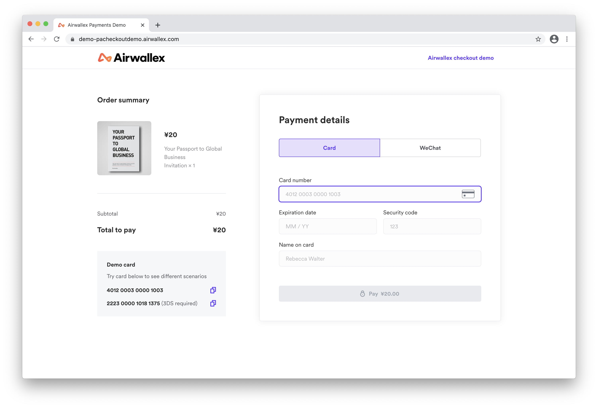

# Airwallex Payment Demo

The purpose of this project is to demonstrate how [Airwallex payment element](https://www.npmjs.com/package/airwallex-payment-elements) can be integrated with different web frameworks. Demos in each framework demonstrate each of the various payment acceptance methods merchants can use.

Our goal is to make it easy for you (Merchants) to use our platform, as easy as a copy-paste!

Before getting start, check out what the Airwallex Checkout elements look like here: [https://demo-pacheckoutdemo.airwallex.com/](https://demo-pacheckoutdemo.airwallex.com/).

## Creating a Payment Intent

Throughout this demo, you will be asked to insert your intent secrets to properly enact a payment checkout, more details can be found in the [Airwallex API](https://www.airwallex.com/docs/api#/Payment_Acceptance/Payment_Intents/Intro).

## Navigating this project

So far, integrations are done with the following frameworks. You can find the installation and development instructions within its subfolder.

API integration:

- [Node](/integrations/node)

Frontend integration:

- [React](/integrations/react)
- [React Typescript](/integrations/react-ts)
- [Angular](/integrations/angular)
- [CDN](/integrations/cdn)
- [Vue](/integrations/vue)

## Other Integrations

For those using [Next.js](https://nextjs.org/) as their web framework, feel free to see the [React](/integrations/react)/[React Typescript](/integrations/react-ts) examples.

## Sandboxes

You also can play around with the different web integrations with the sandboxes below:

- [Static HTML](https://codesandbox.io/s/airwallex-payment-demo-static-html-c2z63)
- [React](https://codesandbox.io/s/airwallex-payment-demo-react-2m63j)
- [React-Typescript](https://codesandbox.io/s/airwallex-payment-demo-react-typescript-buuhk)
- [Vue](https://codesandbox.io/s/airwallex-payment-demo-vue-ffhrw)
- [Angular](https://codesandbox.io/s/airwallex-payment-demo-angular-zgx32)

## Questions, comments, or suggestions?

Running into issues? Check out some of the common errors and our troubleshooting tips [here](/docs#common-errors).

We want to provide you with a seamless experience integrating with our platform. [Let us know](https://www.airwallex.com/contact-sales) if you run into problems, or have any comments and suggestions for us. We value your input!
