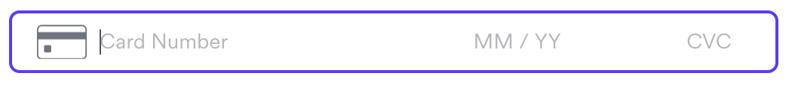

# Components SDK - Card Element Integration

The Card element allows merchants to embed a card element checkout option on their website. This element gives merchant control over the overall look and feel of their checkout page, while delegating the responsibility of payment processing to Airwallex. The Card element is a single-line element with card number, expiry date, and card CVC embedded together.

 \* _An example of a card element. Can be customized._

## Guide

The following steps demonstrates the best practices to integrating with our payment platform. Code is in Javascript.

Want more details? See the integration in [React](/integrations/cdn (components-sdk)/card.html).

### 1. Initialize Payment Object

At the start of your file, initialize the Airwallex SDK. You can do this either by importing the SDK or adding it as a script in your HTML.

#### Importing the SDK

```js
import { init } from '@airwallex/components-sdk';

const { payment } = await init({
  env: 'demo', // Choose the Airwallex environment ('staging', 'demo', or 'prod')
  origin: window.location.origin, // Set your event target to receive browser event messages
});
```

#### Adding the SDK as a Script

Add the following script in your HTML `<head>`:

```html
<script src="https://static.airwallex.com/components/sdk/v1/index.js"></script>
```

Then, initialize the SDK using the global `AirwallexComponentsSDK` object:

```js
const { payment } = await window.AirwallexComponentsSDK.init({
  env: 'demo', // Choose the Airwallex environment ('staging', 'demo', or 'prod')
  origin: window.location.origin, // Set your event target to receive browser event messages
});
```

### 2. Add an empty container for the card element to be injected into and a submit button to trigger the payment request

```html
<div id="card"></div>
<button id="submit">Submit</button>
```

We will mount the card element into the empty div in step 5 and create a handler for the submit button in step 6.

### 3. Create the card element

This creates the specified [Element](/docs-components-sdk#Element) object. We specify the type as `card`.

```js
const card = await payment.createElement('card');
```

You can also add additional options as a second parameter to the `createElement` function that can overwrite styles and other functions. [See docs](/docs-components-sdk#createElement) for more details.

### 4. Mount the card element

Next, we need to mount the card element to the DOM.

```js
const domElement = card.mount('card');
```

This function will append the card element to your div with an id `card` as created above in step 3. **Ensure that there are no other elements in the document with the same id**.

The **element should only be mounted once** in a single payment flow.

### 5. Add a button handler to trigger the payment request and listen to the request response.

This handler is called when a customer is ready to make a payment according to the details documented in the Payment Intent, thereby confirming the Payment Intent.

```js
// STEP #6a: Add a button handler
document.getElementById('submit').addEventListener('click', () => {
  card.confirm({
    element: card, // Provide Card element
    intent_id: 'replace-with-your-intent-id', // Payment Intent ID
    client_secret: 'replace-with-your-client-secret', // Client Secret
  }).then((response) => {
    // STEP #6b: Listen to the request response
    /* Handle response */
    window.alert(JSON.stringify(response));
  });
});
```

`card.confirm` will take the card element you mounted and confirm the payment details entered to the payment intent (provided by the `id` prop). A `client_secret` must be provided to authenticate the checkout process.


### 6. Add an `onReady` event listener to handle events when the element is mounted

```js
domElement.addEventListener('onReady', (event) => {
  /*
    ... Handle event
  */
  window.alert(event.detail);
});
```

This can be used to set a loading state as the checkout screen is being prepared.

### 8. Beautify and deploy!

## Documentation

See the full documentation for `@airwallex/components-sdk` [here](/docs).

## Integration Examples

Check out [airwallex-payment-demo](/../../tree/master) for integration examples with different web frameworks!

## Full Code Example

```html
<!DOCTYPE html>
<html>
  <head lang="en">
    <meta charset="utf-8" />
    <meta name="viewport" content="width=device-width, initial-scale=1" />
    <title>Airwallex Checkout Playground</title>
    <!-- STEP #1: Import @airwallex/components-sdk bundle -->
    <script src="https://static.airwallex.com/components/sdk/v1/index.js"></script>
  </head>

  <body>
    <h1>Card integration</h1>
    <label>
      Card Information
      <!-- STEP #3a: Add an empty container for the card element to be injected into -->
      <div id="card"></div>
    </label>
    <br />
    <!-- STEP #3b: Add a submit button to trigger the payment request -->
    <button id="submit">Submit</button>

    <script>
      // STEP #2: Initialize the Airwallex global context for event communication
      const { payment } = await window.AirwallexComponentsSDK.init({
        env: 'staging', // Setup which Airwallex env('staging' | 'demo' | 'prod') to integrate with
        origin: window.location.origin, // Setup your event target to receive the browser events message
      });
      // STEP #4: Create 'card' element
      const card = await payment.createElement('card');

      // STEP #5: Mount card element
      const domElement = card.mount('card');

      // STEP #6a: Add a button handler to trigger the payment request
      document.getElementById('submit').addEventListener('click', () => {
        card.confirm({
          element: card,
          intent_id: 'replace-with-your-intent-id',
          client_secret: 'replace-with-your-client-secret',
        })
          .then((response) => {
            // STEP #6b: Listen to the request response
            /* handle confirm response*/
            window.alert(JSON.stringify(response));
          })
          .catch((response) => {
            // STEP #6c: Listen to the error response
            /* handle error response*/
            console.log('There was an error', response);
          });
      });

      // STEP #7: Add an event listener to ensure the element is mounted
      domElement.addEventListener('onReady', (event) => {
        /*
        ... Handle event
         */
        window.alert(event.detail);
      });
    </script>
  </body>
</html>
```
