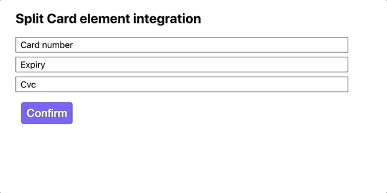
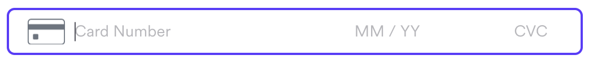

# Recurring flow

The Recurring flow enables shopper to create and save their CIT(customer initial transaction) and MIT(merchant initial transaction) payment consent which could be use to payment in the future transaction. 

### Create payment consent 

For HPP, dropIn and full feture card element users, 
You could simply provide a `mode: recurring'` during `createElement` to use the recurring function, [read more](/docs-components-sdk#options-object-properties-1).

For card element and split card element, follow the guide below. We could either simply create a consent or create a consent while confirm an intent with this consent.


\* _An example of a split card integration. Can be customized._


\* _An example of a card element. Can be customized._

## Guide for `Create payment consent`

The following steps demonstrates the best practices to integrating with our payment platform. Code is in Javascript.

Want more details? See the integration in [React](/integrations/cdn (components-sdk)/split-card.html).

### 1. Follow the split card element / card element integration document step 1-5

You can choose the split card element or card element to setup the recurring flow. Follow the steps 1-5 in the integration doc.

[Split card element integration guide](https://github.com/airwallex/airwallex-payment-demo/blob/master/docs-components-sdk/splitcard.md#guide)

[Card element integration guide](https://github.com/airwallex/airwallex-payment-demo/blob/master/docs-components-sdk/card.md#guide)
 
### 2. Add a button handler to trigger the recurring request and listen to the request response.

This handler is called when a customer is ready to create a consent along with the necessary payload according to your requirement.

```js
// STEP #6a: Add a button handler
document.getElementById('submit').addEventListener('click', () => {
  await payment.createPaymentConsent({
    intent_id: 'replace-with-your-intent-id', // intent id(Optional)
    customer_id: 'replace-with-your-customer-id', // customer id
    client_secret: 'replace-with-your-client-secret', // client secret (from creating intent or generating client secret)
    currency: 'replace-with-your-currency', // currency
    element: 'cardElement', // either the card element or card number element depends on the element you integrate,
    next_triggered_by: 'customer', // 'merchant' for MIT and 'customer' for CIT
  }).then((response) => {
    // STEP #6b: Listen to the request response
    /* Handle response */
    window.alert(JSON.stringify(response));
  });
});
```

`payment.createPaymentConsent` will take the cardNumber element or card element you mounted and create payment consent.

More details about the `createPaymentConsent` function can be found [here](/docs-components-sdk#createPaymentConsent).

### 3. Follow the split card element / card element integration document step 7-9

[Split card element integration guide](https://github.com/airwallex/airwallex-payment-demo/blob/master/docs-components-sdk/splitcard.md#guide)

[Card element integration guide](https://github.com/airwallex/airwallex-payment-demo/blob/master/docs-components-sdk/card.md#guide)

## Full Code Example

```html
<!DOCTYPE html>
<html>
  <head lang="en">
    <meta charset="utf-8" />
    <meta name="viewport" content="width=device-width, initial-scale=1" />
    <title>Airwallex Checkout Playground</title>
    <!-- STEP #1: Import @airwallex/components-sdk bundle -->
    <script src="https://static.airwallex.com/components/sdk/v1/index.js"></script>
  </head>

  <body>
    <h1>Split Card integration</h1>
    <div id="element">
      Card Information
      <!-- STEP #3a: Add empty containers for each card input element to be injected into -->
      <div style={containerStyle}>
        <div>Card number</div>
        <div id="cardNumber"></div>
      </div>
      <div style={containerStyle}>
        <div>Expiry</div>
        <div id="expiry"></div>
      </div>
      <div style={containerStyle}>
        <div>Cvc</div>
        <div id="cvc"></div>
    </div>
    <br />
    <!-- STEP #3b: Add a submit button to trigger the payment request -->
    <button id="submit">Submit</button>

    <script>
      // STEP #2: Initialize the Airwallex global context for event communication
      const { payment } = await window.AirwallexComponentsSDK.init({
        env: 'staging', // Setup which Airwallex env('staging' | 'demo' | 'prod') to integrate with
        origin: window.location.origin, // Setup your event target to receive the browser events message
      });
      // STEP #4: Create split card elements
      const cardNumber = await payment.createElement('cardNumber');
      const expiry = await payment.createElement('expiry');
      const cvc = await payment.createElement('cvc');

      // STEP #5: Mount split card elements
      const domElement = cardNumber.mount('cardNumber');
      expiry.mount('expiry');
      cvc.mount('cvc');

      // STEP #6a: Add a button handler to trigger the payment request
      document.getElementById('submit').addEventListener('click', () => {
        payment.createPaymentConsent({
          intent_id: 'replace-with-your-intent-id', // intent id(Optional)
          customer_id: 'replace-with-your-customer-id', // customer id
          client_secret: 'replace-with-your-client-secret', // client secret
          currency: 'replace-with-your-currency', // currency
          element: cardElement, // either the card element or card number element depends on the element you integrate,
          next_triggered_by: 'customer' // 'merchant' for MIT and 'customer' for CIT
        }).then((response) => {
          // STEP #6b: Listen to the request response
          /* handle create consent response in your business flow */
          window.alert(JSON.stringify(response));
        });
      });

      // STEP #7: Add an event listener to ensure the element is mounted
      domElement.addEventListener('onReady', (event) => {
        /*
        ... Handle event
         */
        window.alert(event.detail);
      });

      // STEP #8: Add an event listener to listen to the changes in each of the input fields
      domElement.addEventListener('onChange', (event) => {
        /*
        ... Handle event
         */
        window.alert(event.detail);
      });
    </script>
  </body>
</html>
```
