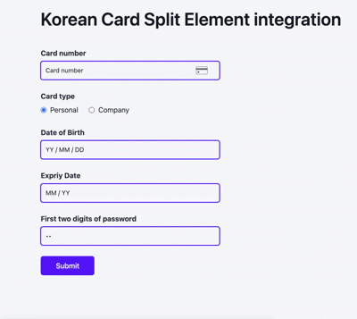

# Components SDK - Korean Card Split Element Integration

The korean card split element enables merchants to process a card checkout on their website, with greater control over the look and feel of their checkout page.

This element differs from the card split element as it allows merchants to embed individual input fields that follows korean local card payment flow, we provide 4 different elements, they are:

- card number,
- card identifier (date of birth / business number)
- card expiry
- first two digit of password



\* _An example of korean card split element integration. Can be customized._

## Guide

The following steps demonstrates the best practices to integrating with our payment platform. (Code is in Javascript)

### 1. Initialize Payment Object

At the start of your file, initialize the Airwallex SDK. You can do this either by importing the SDK or adding it as a script in your HTML.

#### Option 1: Importing the SDK

```js
import { init } from '@airwallex/components-sdk';

await init({
  env: 'demo', // Choose the Airwallex environment ( 'demo', or 'prod')
  enabledElements: ['payments'],
});
```

#### Option 2: Adding the SDK as a Script

Add the following script in your HTML `<head>`:

```html
<script src="https://static.airwallex.com/components/sdk/v1/index.js"></script>
```

Then, initialize the SDK using the global `AirwallexComponentsSDK` object:

```js
await window.AirwallexComponentsSDK.init({
  env: 'demo', // Setup which Airwallex env('staging' | 'demo' | 'prod') to integrate with
  enabledElements: ['payments'],
});
```

### 2. Add empty containers for each field, a radio group for card type selection and a submit button to trigger the payment request

```html
<div>
  <div>Card number</div>
  <div id="krCardNumber"></div>
</div>
<!-- card type radio group -->
<!-- radio value should be either 'personal' or 'company' -->
<div>
  <div>Card type</div>
  <div>
    <label>
      <!-- set 'personal' as default -->
      <input type="radio" value="personal" name="cardTypeRadio" checked />
      <span>Personal</span>
    </label>
    <label>
      <input type="radio" value="company" name="cardTypeRadio" />
      <span>Company</span>
    </label>
  </div>
</div>
<div>
  <!-- When cardType is personal -->
  <div id="krCardDob">Date of Birth</div>

  <!-- When cardType is company -->
  <!-- <div id='krCardBusinessNo'>Business number</div> -->
  <div id="krCardIdentifier"></div>
</div>
<div>
  <div>Expriy Date</div>
  <div id="krCardExpiry"></div>
</div>
<div>
  <div>First two digits of password</div>
  <div id="krCardPswFirst2"></div>
</div>
<br />
<button id="submit">Submit</button>
```

In step 4, we will mount the split elements into those empty divs.

In step 5, we will create corresponding handler for the `cardType` radio and the submit button.

### 3. Create korean card split elements

This creates the specified [Element](/docs-components-sdk#Element) objects. We specify the types as `krCardNumber`, `krCardIdentifier`, `krCardExpiry` and `krCardPswFirst2` respectively.

```js
const [krCardNumber, krCardIdentifier, krCardExpiry, krCardPswFirst2] = await Promise.all([
  window.AirwallexComponentsSDK.createElement('krCardNumber'),
  window.AirwallexComponentsSDK.createElement('krCardIdentifier', {
    /* should match the default active radio button */
    cardType: 'personal',
  }),
  window.AirwallexComponentsSDK.createElement('krCardExpiry'),
  window.AirwallexComponentsSDK.createElement('krCardPswFirst2'),
]);
```

There are also additional options as a second parameter to the `createElement` function that can overwrite styles and other functions. [See docs](/docs-components-sdk#createElement) for more details.

### 4. Mount the split card elements

Next, we need to mount the card element to the DOM.

```js
await Promise.all([
  /* This 'krCardNumber' id MUST MATCH the id on your cardNumber empty container created in Step 2 */
  krCardNumber.mount('krCardNumber'),
  /* Same as above */
  krCardIdentifier.mount('krCardIdentifier'),
  /* Same as above */
  krCardExpiry.mount('krCardExpiry'),
  /* Same as above */
  krCardPswFirst2.mount('krCardPswFirst2'),
]);
```

This function will append the card element to your divs with ids `krCardNumber`, `krCardIdentifier`, `krCardExpiry`and `krCardPswFirst2` respectively. **Ensure that there are no other elements in the document with the same ids**.

Each **element should only be mounted once** in a single payment flow.

### 5. Add handlers for `cardType` radio group and submit button

#### 5a: Add handler for 'cardType' radio button group

```js
/* query form labels for identifier */
const dobFieldLabel = document.getElementById('krCardDob');
const businessNumberFieldLabel = document.getElementById('krCardBusinessNo');

const setupRadioGroupListener = () => {
  /* query all the radio buttons */
  const radioButtons = document.querySelectorAll('input[name="cardTypeRadio"]');

  const updateIdentifierCardType = (cardType) => {
    /* check if identifier is ready */
    if (krCardIdentifier) {
      try {
        /* calling krCardIdentifier.update() to change the cardType option for krCardIdentifier */
        krCardIdentifier.update({ cardType });
      } catch (error) {
        /* Handle error */
        console.error('Error updating krCardIdentifier cardType:', error);
      }
    } else {
      /* krCardIdentifier is not ready */
      console.warn('krCardIdentifier element is not ready yet');
    }
  };

  /* set handlers for radio button */
  radioButtons.forEach((radio) => {
    radio.addEventListener('change', (event) => {
      if (event.target.checked) {
        const cardType = event.target.value;
        /* display the correct form label */
        if (cardType === 'personal') {
          dobFieldLabel.style.display = 'block';
          businessNumberFieldLabel.style.display = 'none';
        } else {
          dobFieldLabel.style.display = 'none';
          businessNumberFieldLabel.style.display = 'block';
        }

        /* update cardType for element krCardIdentifier */
        updateIdentifierCardType(cardType);
      }
    });
  });

  /* set initial value based on checked radio button */
  const checkedRadio = document.querySelector('input[name="cardTypeRadio"]:checked');
  if (checkedRadio) {
    updateIdentifierCardType(checkedRadio.value);
  }
};
// Calling the handler
setupRadioGroupListener();
```

This handler is called when a customer is ready to make a payment according to the details documented in the Payment Intent, thereby confirming the Payment Intent.

#### 5b: Add handler for submit button

```js
document.getElementById('submit').addEventListener('click', () => {
  krCardNumber
    .confirm({
      client_secret: 'replace-with-your-client-secret', // Client Secret
    })
    .then((response) => {
      /* Handle response */
      window.alert(JSON.stringify(response));
    });
});
```

`krCardNumber.confirm` will take the cardNumber element you mounted and confirm the payment details entered to the payment intent (provided by the `id` prop). A `client_secret` must be provided to authenticate the checkout process.

### 6. (Optional) Add `ready` event listener to handle events when the element is mounted

```js
cardNumber.on('ready', (event) => {
  /*
    ... Handle event
  */
  window.alert(event.detail);
});
```

This can be used to set a loading state as the checkout screen is being prepared.

### 7. (Optional) Add `change`,`focus`, `blur` and `error`event listeners

```js
elementArray.forEach((element) => {
  element.on('change', (event) => {
    /* Customize change event */
  });
});

elementArray.forEach((element) => {
  element.on('focus', (event) => {
    /* Customize focus event */
  });
});

elementArray.forEach((element) => {
  element.on('blur', (event) => {
    /* Customize blur event*/
  });
});

elementArray.forEach((element) => {
  element.on('error', (event) => {
    /*  Customize error event */
  });
});
```

`event` will return an object with the field name and whether this field is completed (valid). This can help with validating the fields before users can trigger the submit button to prevent any validation errors.

### 8. Beautify and deploy!

## Documentation

See the full documentation for `@airwallex/components-sdk` [here](https://www.airwallex.com/docs/js/payments/card-number/).

## Integration Examples

Check out [airwallex-payment-demo](/../../tree/master) for integration examples with different web frameworks!

## Full Code Example

```html
<!DOCTYPE html>
<html>
  <head lang="en">
    <meta charset="utf-8" />
    <meta name="viewport" content="width=device-width, initial-scale=1" />
    <title>Airwallex Checkout Playground</title>
    <!-- STEP #1: Import @airwallex/components-sdk bundle -->
    <script src="https://static.airwallex.com/components/sdk/v1/index.js"></script>
  </head>

  <body>
    <h1>Korean Card Split Element integration</h1>
    <br />
    <!-- STEP #2: Add empty containers for each card input element to be injected into -->
    <div>
      <div>Card number</div>
      <div id="krCardNumber"></div>
    </div>
    <div>
      <div>Card type</div>
      <div>
        <label>
          <input type="radio" value="personal" name="cardTypeRadio" checked />
          <span>Personal</span>
        </label>
        <label>
          <input type="radio" value="company" name="cardTypeRadio" />
          <span>Company</span>
        </label>
      </div>
    </div>
    <div>
      <div id="krCardDob">Date of Birth</div>
      <!-- <div id='krCardBusinessNo'>Business number</div> -->
      <div id="krCardIdentifier"></div>
    </div>
    <div>
      <div>Expriy Date</div>
      <div id="krCardExpiry"></div>
    </div>
    <div>
      <div>First two digits of password</div>
      <div id="krCardPswFirst2"></div>
    </div>
    <br />
    <button id="submit">Submit</button>

    <script>
      (async () => {
        // STEP #1: Initialize the Airwallex global context for event communication
        await window.AirwallexComponentsSDK.init({
          env: 'demo',
          enabledElements: ['payments'],
        });
        // STEP #3: Create korean card split elements
        const [krCardNumber, krCardIdentifier, krCardExpiry, krCardPswFirst2] = await Promise.all([
          window.AirwallexComponentsSDK.createElement('krCardNumber'),
          window.AirwallexComponentsSDK.createElement('krCardIdentifier', {
            /* should match the default active radio button */
            cardType: 'personal',
          }),
          window.AirwallexComponentsSDK.createElement('krCardExpiry'),
          window.AirwallexComponentsSDK.createElement('krCardPswFirst2'),
        ]);

        // STEP #4: Mount split card elements
        await Promise.all([
          /* This 'krCardNumber' id MUST MATCH the id on your cardNumber empty container created in Step 2 */
          krCardNumber.mount('krCardNumber'),
          /* Same as above */
          krCardIdentifier.mount('krCardIdentifier'),
          /* Same as above */
          krCardExpiry.mount('krCardExpiry'),
          /* Same as above */
          krCardPswFirst2.mount('krCardPswFirst2'),
        ]);

        // STEP #5a: Add handler for submit button
        document.getElementById('submit').addEventListener('click', () => {
          krCardNumber
            .confirm({
              id: 'replace-with-your-intent-id',
              client_secret: 'replace-with-your-client-secret',
            })
            .then((response) => {
              window.alert(JSON.stringify(response));
            });
        });

        // STEP #5b: Add handler for 'cardType' radio button group
        const dobFieldLabel = document.getElementById('krCardDob');
        const businessNumberFieldLabel = document.getElementById('krCardBusinessNo');

        const setupRadioGroupListener = () => {
          const radioButtons = document.querySelectorAll('input[name="cardTypeRadio"]');

          const updateIdentifierCardType = (cardType) => {
            if (krCardIdentifier) {
              try {
                krCardIdentifier.update({ cardType });
              } catch (error) {
                console.error('Error updating krCardIdentifier cardType:', error);
              }
            } else {
              console.warn('krCardIdentifier element is not ready yet');
            }
          };

          radioButtons.forEach((radio) => {
            radio.addEventListener('change', (event) => {
              if (event.target.checked) {
                const cardType = event.target.value;
                if (cardType === 'personal') {
                  dobFieldLabel.style.display = 'block';
                  businessNumberFieldLabel.style.display = 'none';
                } else {
                  dobFieldLabel.style.display = 'none';
                  businessNumberFieldLabel.style.display = 'block';
                }

                updateIdentifierCardType(cardType);
              }
            });
          });

          const checkedRadio = document.querySelector('input[name="cardTypeRadio"]:checked');
          if (checkedRadio) {
            updateIdentifierCardType(checkedRadio.value);
          }
        };
        setupRadioGroupListener();

        // STEP #6: Add an event listener to ensure the element is mounted
        cardNumber.on('ready', (event) => {
          window.alert(event.detail);
        });

        // Step #7: Add `change`,`focus`, `blue` and `error`event listeners
        elementArray.forEach((element) => {
          element.on('change', (event) => {});
        });

        elementArray.forEach((element) => {
          element.on('focus', (event) => {});
        });

        elementArray.forEach((element) => {
          element.on('blur', (event) => {});
        });

        elementArray.forEach((element) => {
          element.on('error', (event) => {});
        });
      })();
    </script>
  </body>
</html>
```
