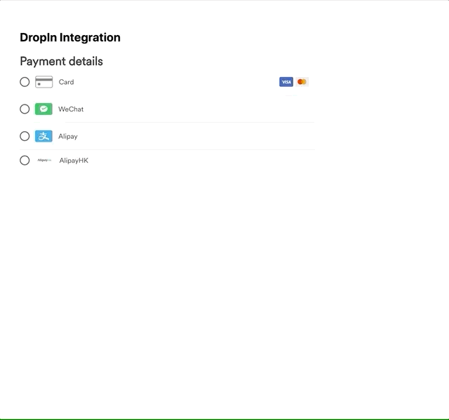

# Components SDK - Drop-in Element Integration

The Drop-in element allows merchants to embed a card element checkout option on their website. This element gives merchant control over the overall look and feel of their checkout page, while delegating the responsibility of payment processing to Airwallex. It gives customers different payment options.



\* _An example of a Drop-in element._

## Guide

The following steps demonstrates the best practices to integrating with our payment platform. Code is in Javascript.

Want more details? See the integration in [React](/integrations/cdn (components-sdk)/dropin.html).

### 1. Initialize SDK

At the start of your file, initialize the Airwallex SDK. You can do this either by importing the SDK or adding it as a script in your HTML.

#### Importing the SDK

```js
import { init } from '@airwallex/components-sdk';

await init({
  env: 'demo', // Choose the Airwallex environment ('demo' | 'prod')
  enabledElements: ['payments'],
});
```

#### Adding the SDK as a Script

Add the following script in your HTML `<head>`:

```html
<script src="https://static.airwallex.com/components/sdk/v1/index.js"></script>
```

Then, initialize the SDK using the global `AirwallexComponentsSDK` object:

```js
await window.AirwallexComponentsSDK.init({
  env: 'demo', // Choose the Airwallex environment ('demo' | 'prod')
  enabledElements: ['payments'],
});
```


### 2. Add an empty container for the card element to be injected into and a submit button to trigger the payment request

```html
<div id="drop-in"></div>
```

We will mount the card element into the empty div in step 5.

### 3. Create the dropIn element

This creates the specified [Element](/docs-components-sdk#Element) object. We specify the type as **`dropIn`**.

```js
import {createElement} from '@airwallex/components-sdk';
const element = await createElement('dropIn', {
  intent_id: 'replace-with-your-intent-id',
  client_secret: 'replace-with-your-client-secret',
  currency: 'replace-with-your-intent-currency',
  // if you want to use apple pay, please pass merchant country code in applePayRequestOptions
  applePayRequestOptions: {
    countryCode: 'replace-with-your-country-code',
  },
  // if you want to use google pay, please pass merchant country code in googlePayRequestOptions
  googlePayRequestOptions: {
    countryCode: 'replace-with-your-country-code',
  },
  // theme field is optional, you can customize dropIn element style here
  theme: {
    palette: {
      primary: '#612FFF', // brand color, the default value is #612FFF
    }
  }
});
```

You **must provide intent details** to create the dropIn element.

There are also additional options as a second parameter to the `createElement` function that can overwrite styles and other functions. [See docs](https://www.airwallex.com/docs/js/payments/dropin/#createElement) for more details.

### 4. Mount the card element

Next, we need to mount the card element to the DOM.

```js
const domElement = element.mount('drop-in');
```

This function will append the card element to your div with an id `drop-in` as created in step 3. **Ensure that there are no other elements in the document with the same id**.

The **element should only be mounted once** in a single payment flow.

### 5. Add an `ready` event listener to handle events when the element is mounted

```js
element.on('ready', (event) => {
  /*
    ... Handle event
  */
  window.alert(event.detail);
});
```

This can be used to set a loading state as the checkout screen is being prepared.

### 6. Add an `success` event listener to handle events when the payment is successful.

```js
element.on('success', (event) => {
  /*
    ... Handle event on success
  */
  window.alert(event.detail);
});
```

### 7. Add an `error` event listener to handle events when the payment has failed.

```js
element.on('error', (event) => {
  /*
    ... Handle event on error
  */
  window.alert(event.detail);
});
```

### 8. Add an `pendingVerifyAccount` event listener if you want to integrate with `ach_direct_debit` or `becs_direct_debit` payment method.

When the event triggers, it means the shopper needs to verify the bank account before proceeding the payment. We have a pre-defined page to tell the shoppers what they should do next, and of course you can use your own customized page too.

```js
element.on('pendingVerifyAccount', (event) => {
  /*
   ** handle event on pending verify bank account
   */
  window.alert(event.detail);
});
```

### 9. Beautify and deploy!

## Documentation

See the full documentation for `@airwallex/components-sdk` [here](https://airwallex.com/docs/js/payments/dropin/).

## Integration Examples

Check out [airwallex-payment-demo](/../../tree/master) for integration examples with different web frameworks!

## Full Code Example

```html
<!DOCTYPE html>
<html>
  <head lang="en">
    <meta charset="utf-8" />
    <meta name="viewport" content="width=device-width, initial-scale=1" />
    <title>Airwallex Checkout Playground</title>
    <!-- STEP #1: Import @airwallex/components-sdk bundle -->
    <script src="https://static.airwallex.com/components/sdk/v1/index.js"></script>
  </head>
  <body>
    <h1>DropIn integration</h1>
    <!-- STEP #3: Add an empty container for the dropIn element to be injected into -->
    <div id="dropIn"></div>
    <script>
      (async () => {
        // STEP #2: Initialize the Airwallex global context for event communication
        await window.AirwallexComponentsSDK.init({
          env: 'demo', // Setup which Airwallex env( 'demo' | 'prod') to integrate with
          enabledElements: ['payments'],
        });

        // STEP #4: Create 'dropIn' element
        const dropIn = await window.AirwallexComponentsSDK.createElement('dropIn', {
          // Required, dropIn use intent Id and client_secret to prepare checkout
          intent_id: 'replace-with-your-intent-id',
          client_secret: 'replace-with-your-client-secret',
          currency: 'replace-with-your-intent-currency',
          // customize the look and feel of the dropin components, more information can be found: https://www.airwallex.com/docs/js/payments/hosted-payment-page/#properties-appearance
          appearance: {
            mode: 'light',
            variables: {
              colorBrand: '#612FFF',
            },
          },
          // if you want to use apple pay, please pass merchant country code in applePayRequestOptions
          applePayRequestOptions: {
            countryCode: 'replace-with-your-country-code',
          },
          // if you want to use google pay, please pass merchant country code in googlePayRequestOptions
          googlePayRequestOptions: {
            countryCode: 'replace-with-your-country-code',
          },
        });

        // STEP #5: Mount 'dropIn' element
        const domElement = dropIn.mount('dropIn');

        // STEP #6: Add an event listener to handle events when the element is mounted
        dropIn.on('ready', (event) => {
          /*
            ... Handle event
          */
          window.alert(event.detail);
        });

        // STEP #7: Add an event listener to handle events when the payment is successful.
        dropIn.on('success', (event) => {
          /*
            ... Handle event on success
          */
          window.alert(event.detail);
        });

        // STEP #8: Add an event listener to handle events when the payment has failed.
        dropIn.on('error', (event) => {
          /*
            ... Handle event on error
          */
          console.log(event.detail);
        });
      })();
    </script>
  </body>
</html>
```
