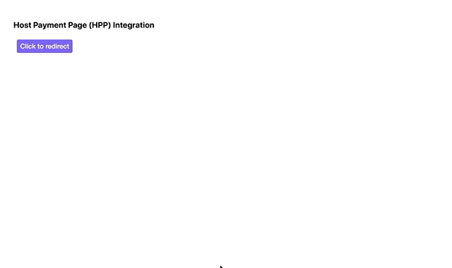

# Components SDK - Hosted Payment Page Integration

The HPP checkout option redirects customers to an Airwallex checkout page, allowing merchants to accept payments without the full responsibility of handling payment acceptance and displaying payment options.



\* _An example of an HPP integration with a button click for redirection._

## Guide

The following steps demonstrates the best practices to integrating with our payment platform. Code is in Javascript.

Want more details? See the integration in [React](/integrations/cdn (components-sdk)/hpp.html).

### 1. Initialize Payment Object

At the start of your file, initialize the Airwallex SDK. You can do this either by importing the SDK or adding it as a script in your HTML.

#### Importing the SDK

```js
import { init } from '@airwallex/components-sdk';

const { payments } = await init({
  env: 'demo', // Choose the Airwallex environment ('demo' | 'prod')
  enabledElements: ['payments'],
});
```

#### Adding the SDK as a Script

Add the following script in your HTML `<head>`:

```html
<script src="https://static.airwallex.com/components/sdk/v1/index.js"></script>
```

Then, initialize the SDK using the global `AirwallexComponentsSDK` object:

```js
const { payments } = await window.AirwallexComponentsSDK.init({
  env: 'demo', // Choose the Airwallex environment ('demo' | 'prod')
  enabledElements: ['payments'],
});
```

### 2. Add a checkout button

```html
<button id="hpp">Checkout</button>
```

We will add the button listener in the next step.

### 3. Add a button handler to trigger the redirect

```js
payment.redirectToCheckout({
  intent_id: 'replace-with-your-intent-id',
  client_secret: 'replace-with-your-client-secret',
  currency: 'replace-with-your-currency',
  country_code: 'replace-with-your-country-code',
});
```

`redirectToCheckout` will redirect customers to an Airwallex checkout page that matches the payment intent details (provided by Payment Intent `id` prop). Customers will do their payment transaction there.

Merchants can add more features to the checkout including the success or failure url to redirect customers back to the merchant site. More details about the `redirectToCheckout` function can be found [here](/docs-components-sdk#redirectToCheckout).

## Documentation

See the full documentation for `@airwallex/components-sdk` [here](https://www.airwallex.com/docs/js/payments/hosted-payment-page/).

## Integration Examples

Check out [airwallex-payment-demo](/../../tree/master) for integration examples with different web frameworks!

## Full Code Example

### Redirect to HPP for checkout

```html
<!DOCTYPE html>
<html>
  <head lang="en">
    <meta charset="utf-8" />
    <meta name="viewport" content="width=device-width, initial-scale=1" />
    <title>Airwallex Checkout Playground</title>
    <!-- STEP #1: Import @airwallex/components-sdk bundle -->
    <script src="https://static.airwallex.com/components/sdk/v1/index.js"></script>
  </head>
  <body>
    <h1>Hosted payment page (HPP) integration</h1>
    <!-- STEP #3: Add a checkout button -->
    <button id="hpp">Redirect to HPP for checkout</button>
    <script>
      (async () => {
        // STEP #2: Initialize the Airwallex package with the appropriate environment
        const { payments } = await window.AirwallexComponentsSDK.init({
          env: 'demo', // Setup which Airwallex env( 'demo' | 'prod') to integrate with
          enabledElements: ['payments'],
        });

        document.getElementById('hpp').addEventListener('click', () => {
          // STEP #4: Add a button handler to trigger the redirect to HPP
          payments.redirectToCheckout({
            env: 'demo', // Which env( 'demo' | 'prod') you would like to integrate with
            mode: 'payment',
            intent_id: 'replace-with-your-intent-id',
            client_secret: 'replace-with-your-client-secret',
            currency: 'replace-with-your-currency',
            country_code: 'replace-with-your-country-code'
          });
        });
      })();
    </script>
  </body>
</html>
```

### Redirect to HPP for recurring

```html
<!DOCTYPE html>
<html>
  <head lang="en">
    <meta charset="utf-8" />
    <meta name="viewport" content="width=device-width, initial-scale=1" />
    <title>Airwallex Checkout Playground</title>
    <!-- STEP #1: Import @airwallex/components-sdk bundle -->
    <script src="https://static.airwallex.com/components/sdk/v1/index.js"></script>
  </head>
  <body>
    <h1>Hosted payment page (HPP) integration</h1>
    <!-- STEP #3: Add a checkout button -->
    <button id="hpp">Redirect to HPP for recurring</button>
    <script>
      // STEP #2: Initialize the Airwallex package with the appropriate environment
      const { payments } = await window.AirwallexComponentsSDK.init({
        env: 'demo', // Setup which Airwallex env( 'demo' | 'prod') to integrate with
        enabledElements: ['payments'],
      });
      document.getElementById('hpp').addEventListener('click', () => {
        // STEP #4: Add a button handler to trigger the redirect to HPP
        payments.redirectToCheckout({
          env: 'demo', // Which env( 'demo' | 'prod') you would like to integrate with
          mode: 'recurring',
          client_secret: 'replace-with-your-client-secret',
          customer_id: 'replace-with-your-customer-id',
          currency: 'replace-with-your-currency',
          country_code: 'replace-with-your-country-code',
          recurringOptions: {
            /**
             * The subsequent transactions are triggered by `merchant` or `customer`
             */
            next_triggered_by: 'merchant',
            /**
             * The reason why merchant trigger transaction. Only applicable when next_triggered_by is `merchant`
             */
            merchant_trigger_reason: 'scheduled',
            /**
             * Currency of the initial PaymentIntent to verify the PaymentConsent. Three-letter ISO currency code
             */
            currency: 'replace-with-your-currency',
          },
        });
      });
    </script>
  </body>
</html>
```
